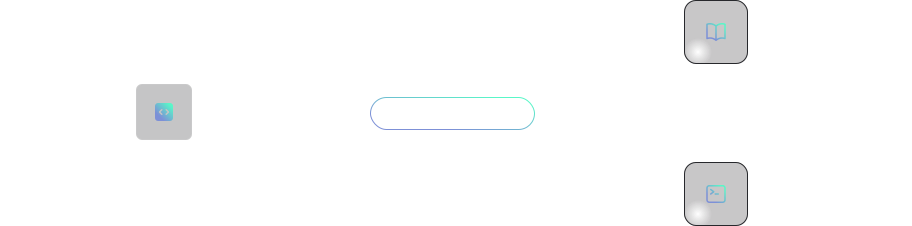

# Bridge Studio




## Connecting your Bridge API to Bridge Studio


### Using the CLI

```bash title='terminal'
npx bridge-studio@latest
# or
pnpx bridge-studio@latest
```

You'll be redirected to the [github login](https://github.com/login/oauth/authorize?client_id=Iv1.61c158472b4a85b9). Sign in with your GitHub account, then copy and paste the secretToken on the Studio Bridge page.

This command-line tool will generate a `bridge.config.json` file for you. To keep your secret token private, consider adding this file to your `.gitignore` before publishing to GitHub.

If you didn't have a Studio Bridge account, this process will create one for you. You can log in to your profile to view and manage your projects at https://studio.bridge.codes.

### Using the plateform

Connect to https://studio.bridge.codes using your GitHub account to import a project from your GitHub repository. The project will be linked to your repository. To recompile the client SDK, simply click the "Recompile" button on the platform.

## Fetch your client SDK

```bash title='terminal'
npx fetch-bridge-sdk@latest {username}/{projectName}
```

If you do not have `axios` and `form-data` installed in your project, the command line will automatically install them for you.

The upcoming version of the command line will allow you to select your preferred HTTP client library, either axios or fetch, and the required packages will be automatically installed if they are not already present in your project.


## Access your generated documentation

You'll be able to access your complete generated documentation on https://studio.bridge.codes soon.

Please visit https://bridge.codes/studio for more information.